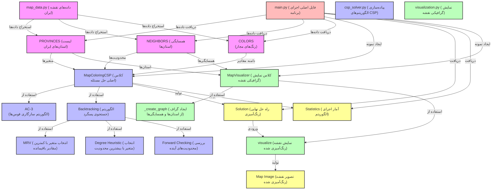

# پروژه رنگ‌آمیزی نقشه ایران با CSP

این پروژه یک پیاده‌سازی از مسئله رنگ‌آمیزی نقشه ایران با استفاده از الگوریتم‌های حل مسئله محدودیت (Constraint Satisfaction Problem) است. در این پروژه، هر استان ایران باید با یکی از رنگ‌های مجاز رنگ‌آمیزی شود به طوری که هیچ دو استان همسایه‌ای رنگ یکسان نداشته باشند.

## ویژگی‌های پروژه

- پیاده‌سازی کامل الگوریتم Backtracking با Forward Checking
- استفاده از استراتژی MRV (Minimum Remaining Values) برای انتخاب متغیر
- استفاده از استراتژی Degree Heuristic برای بهبود کارایی
- پیاده‌سازی الگوریتم AC-3 برای سازگاری قوس‌ها
- نمایش گرافیکی نقشه ایران با استفاده از networkx و matplotlib
- گزارش آماری از تعداد بازگشت‌ها و تخصیص‌های موفق/ناموفق
- امکان تست با تعداد رنگ‌های مختلف

## ساختار پروژه

```
iran_map_coloring/
├── src/
│   ├── __init__.py
│   ├── csp_solver.py     # پیاده‌سازی الگوریتم‌های CSP
│   ├── map_data.py       # داده‌های نقشه ایران (استان‌ها و همسایگی‌ها)
│   └── visualization.py  # کد نمایش گرافیکی نقشه
├── main.py               # فایل اصلی اجرای برنامه
└── requirements.txt      # کتابخانه‌های مورد نیاز
```





## نیازمندی‌ها

برای اجرای این پروژه، به کتابخانه‌های زیر نیاز دارید:

```
numpy
matplotlib
networkx
```

می‌توانید با دستور زیر این کتابخانه‌ها را نصب کنید:

```bash
pip install -r requirements.txt
```

## نحوه اجرا

برای اجرای برنامه، دستور زیر را در ترمینال وارد کنید:

```bash
python main.py
```

### پارامترهای اختیاری

- `--colors`: تعداد رنگ‌های مورد استفاده (پیش‌فرض: 4)
- `--save`: مسیر ذخیره تصویر خروجی
- `--no-visualization`: عدم نمایش گرافیکی

مثال:

```bash
python main.py --colors 3 --save map.png
```

## خروجی مورد انتظار

پس از اجرای برنامه، خروجی زیر نمایش داده می‌شود:

1. لیست استان‌ها و رنگ تخصیص داده شده به هر استان
2. آمار اجرای الگوریتم شامل:
   - تعداد بازگشت‌ها
   - تعداد تخصیص‌ها
   - تعداد شکست‌ها
   - زمان اجرا
3. نمایش گرافیکی نقشه رنگ‌آمیزی شده

## نکات پیاده‌سازی

- کد با توضیحات فارسی مستندسازی شده است
- از بهترین شیوه‌های برنامه‌نویسی Python پیروی شده است
- الگوریتم‌های بهینه‌سازی شده برای حل سریع مسئله استفاده شده است
- مدیریت خطاها به درستی انجام شده است

## مثال خروجی گرافیکی

پس از اجرای برنامه، یک نمایش گرافیکی از نقشه ایران با رنگ‌آمیزی استان‌ها نمایش داده می‌شود. هر استان با یک رنگ متفاوت از همسایگانش رنگ‌آمیزی شده است.